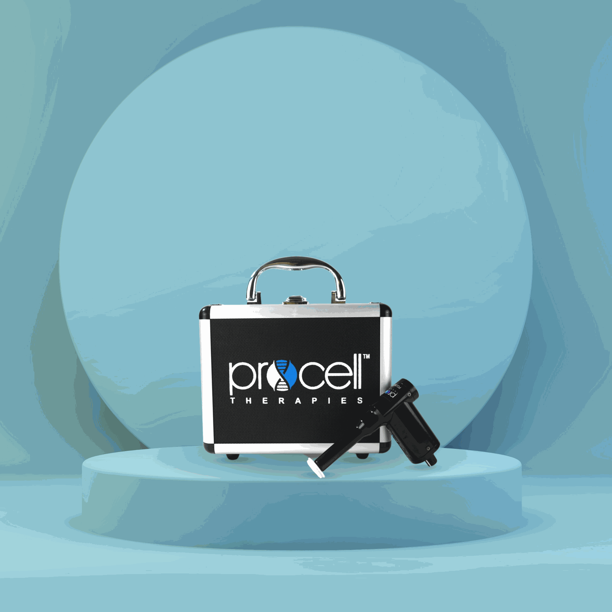

Microneedling/Procell MD
========================

Price: $350

Duration: 60 min

ProCell MD micro channeling is a cutting-edge facial rejuvenation treatment that causes a motorized derma stamping device to create precise, controlled micro-injuries in the skin. These microchannels stimulate the body’s natural healing process, encouraging the production of new collagen and elastin for healthier, more youthful skin. Unlike traditional microneedling, microchanneling is less abrasive and more comfortable. Benefits of ProCell Microchanneling: Reduces acne scarring, fine lines, and wrinkles. Improves skin tone, texture, and elasticity. Minimal discomfort and downtime. While initial improvements are visible shortly after, the full benefits of increased collagen and elastin production may take up to two months to appear. For optimal results, follow-up sessions every 4–6 weeks are recommended, with most clients opting for 3–6 treatments.

|image1|

