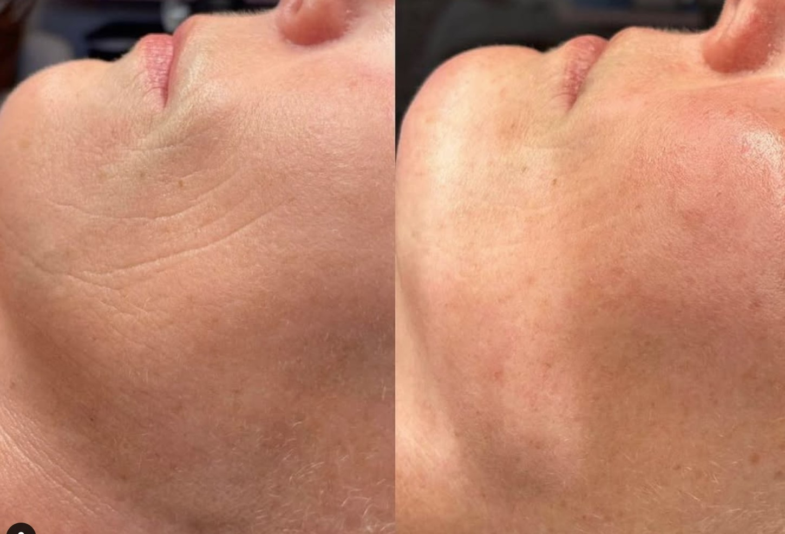

.. modified_time: 2025-05-02T04:02:49.009Z

.. _h.95acgmvw4brx:

ProCell MD Microchanneling
==========================

|image1|

Price: $350

Time: 60 min

A cutting-edge collagen-boosting treatment that improves texture, scars,
and fine lines.

Unlock your skin’s natural potential with ProCell Microchanneling, the
most advanced non-invasive skin renewal treatment. This innovative
procedure enhances collagen and elastin production, improving skin
texture, tone, and radiance with minimal downtime. Customizable Packages
Available.

--------------

.. _h.rzme086qm95k:

What is ProCell Microchanneling?
--------------------------------

ProCell Microchanneling uses a **precision motorized stamping
device** with ultra-fine needles to create controlled
**micro-injuries** in the skin. This triggers your body’s natural repair
process, stimulating collagen production while allowing **medical-grade
serums rich in growth factors** to penetrate deeply for optimal skin
renewal.

|image2|

.. _h.vo6iood087d0:

Why Choose ProCell Microchanneling?
-----------------------------------

✨ **Advanced Technology** – Combines precise microchanneling with
potent serums for superior rejuvenation.

✨ **Non-Surgical, Minimal Downtime** – Achieve dramatic skin
improvements without invasive procedures.

✨ **Versatile Treatment** – Effectively reduces fine lines, wrinkles,
acne scars, hyperpigmentation, enlarged pores, and uneven texture.

✨ **Custom-Tailored** – Personalized to your unique skin needs for the
best possible results.

✨ **Safe & Comfortable** – A virtually painless experience with little
to no recovery time.

.. _h.xmcx1qmo71dy:

How It Works: A 3-Stage Process
-------------------------------

1️⃣ **Microchanneling Stimulation** – Creates microchannels to activate
your skin’s healing response.

2️⃣ **Stem Cell Growth Factor Infusion** – Powerful bone marrow-derived
cytokines reduce inflammation and accelerate repair.

3️⃣ **Cellular Renewal & Regeneration** – Over time, skin firms, smooths,
and brightens as collagen production increases.

.. _h.3t72a7o3fdni:

Results You Can Expect
----------------------

✔ Smoother, firmer skin with improved elasticity

✔ Reduction in **fine lines, wrinkles, and acne scars**

✔ Even skin tone and minimized **hyperpigmentation**

✔ Refined pores and a more youthful glow

**Book your session today and start your journey to healthier,
younger-looking skin!**

Procell Therapies offers cutting-edge biotechnology to induce a
breathtaking transformation to the appearance of the skin that can last
a lifetime.

These serums are designed to help your skin regenerate itself, resulting
in a more youthful appearance. Growth factors are a key component of the
serums, and they help to stimulate the production of collagen and
elastin. As a result, ProCell MD Growth Factor Serums can help you
achieve firmer, smoother, and more youthful-looking skin.

