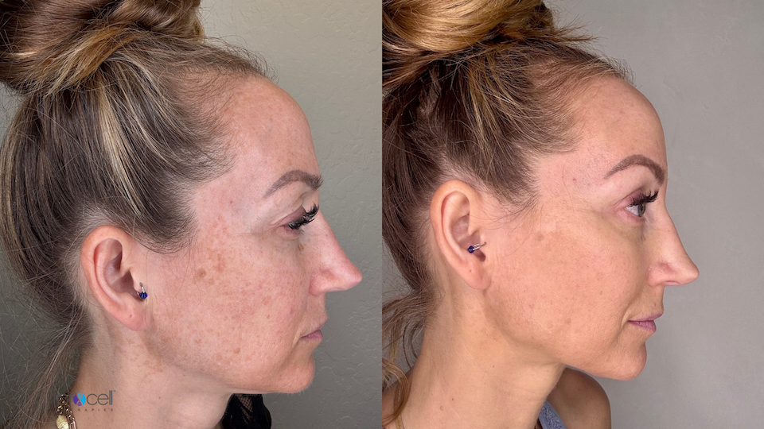

.. modified_time: 2025-05-27T01:30:47.083Z

.. _h.95acgmvw4brx:

ProCell MD Microchanneling
==========================

|image1|

Price: $350

Time: 60 min

Advanced non-invasive skin renewal that boosts collagen and elastin for
improved texture, tone, radiance, and reduced scars and fine lines. This
cutting-edge treatment offers superior results compared to traditional
microneedling with minimal downtime. Customizable packages are available
to unlock your skin's natural potential.

--------------

.. _h.rzme086qm95k:

What is ProCell Microchanneling MD?
-----------------------------------

Procell Microchanneling enhances cellular activity by creating thousands
of microchannels. Each channel prompts an inflammatory response,
initiating collagen formation. Over time, this repeated healing process,
amplified by our clinically proven growth factor serums derived from
stem cells, significantly improves skin texture and overall appearance,
rejuvenating the skin effectively. Procell Microchanneling stimulates
cellular activity through the creation of thousands of
microchannels. This process triggers an inflammatory response, leading
to the formation of new collagen. With repeated treatments, this natural
healing is enhanced by clinically proven stem cell-derived growth factor
serums, resulting in significant improvements to skin texture and
overall appearance, effectively rejuvenating the skin.

|image2|

.. _h.vo6iood087d0:

Why Choose ProCell Microchanneling?
-----------------------------------

✨ **Advanced Technology** – Combines precise microchanneling with
potent serums for superior rejuvenation.

✨ **Non-Surgical, Minimal Downtime** – Achieve dramatic skin
improvements without invasive procedures.

✨ **Versatile Treatment** – Effectively reduces fine lines, wrinkles,
acne scars, hyperpigmentation, enlarged pores, and uneven texture.

✨ **Custom-Tailored** – Personalized to your unique skin needs for the
best possible results.

✨ **Safe & Comfortable** – A virtually painless experience with little
to no recovery time.

|image3|

.. _h.xmcx1qmo71dy:

How It Works: A 3-Stage Process
-------------------------------

1️⃣ **Microchanneling Stimulation** – Creates microchannels to activate
your skin’s healing response.

2️⃣ **Stem Cell Growth Factor Infusion** – Powerful bone marrow-derived
cytokines reduce inflammation and accelerate repair.

3️⃣ **Cellular Renewal & Regeneration** – Over time, skin firms, smooths,
and brightens as collagen production increases.

.. _h.3t72a7o3fdni:

Results You Can Expect
----------------------

✔ Smoother, firmer skin with improved elasticity

✔ Reduction in **fine lines, wrinkles, and acne scars**

✔ Even skin tone and minimized **hyperpigmentation**

✔ Refined pores and a more youthful glow

**Stimulating Skin Rejuvenation**

Procell Microchanneling is a skin rejuvenation treatment that creates
hundreds of thousands of micro-injuries, triggering a natural
inflammatory healing process and the formation of new collagen. This
repeated process improves skin texture and overall appearance.

|image4|

**Benefits of Procell Microchanneling:**

-  Reduces acne and chicken pox scarring
-  Stimulates collagen production and tightens skin
-  Improves fine lines and wrinkles
-  Reduces the appearance of crow’s feet, lip lines, forehead lines, and
   frown lines
-  Improves skin tone and texture
-  Reduces the appearance of stretch marks and surgical scars
-  Reduces the appearance of large pores
-  Restores sun-damaged skin and treats hyperpigmentation and melasma
-  Improves puffy eyes
-  Improves rosacea by strengthening the skin
-  Increases the absorption of medical-grade skincare products (by up to
   300%)
-  Reduces oil levels in the skin
-  Treats all areas of the body
-  Causes less epidermal damage compared to microneedling, laser
   resurfacing, aggressive chemical peels, or plastic surgery
-  Offers more effective treatment with less pain than laser treatments
-  Suitable for all skin types and colors
-  More cost-effective than Fraxel laser treatments
-  Involves very minimal recovery time
-  Can be combined with other skin rejuvenation therapies for enhanced
   results

**How Procell Microchanneling Works:**

This minimally invasive, non-surgical, and non-ablative procedure
preserves the epidermis while creating microchannels. Unlike
microneedling, it avoids scratching or tearing the skin, thus
eliminating the risk of post-inflammatory hyperpigmentation. The
microchannels stimulate the skin's healing response, producing new
collagen and enhanced absorption of cosmeceutical serums and
creams. This award-winning treatment thickens the epidermis.

|image5|

**Procell Microchanneling Candidacy:**

Procell Microchanneling is generally safe for all skin tones. However,
individuals with the following conditions should avoid this treatment:

-  Pregnancy or nursing
-  Uncontrolled diabetes
-  Use of Accutane or related acne medications within the last six
   months
-  Active inflammatory skin conditions (e.g., eczema, psoriasis,
   infection, rash, dermatitis at the treatment site)
-  Laser treatment or deep chemical peel that removed the entire
   epidermis within the last 18 months
-  Newly done fillers within the last two weeks
-  Scars less than 6 months old
-  Keloids or raised scarring
-  History of eczema, psoriasis, or other chronic skin conditions
-  High blood pressure
-  Presence of raised moles, warts, or lesions in the treatment area
-  Currently undergoing or having undergone cancer treatment within the
   last 6 months
-  Allergy to steel
-  Chronic skin disease
-  Hemophilia

Individuals with a history of cold sores should consult their physician
about prophylactic treatment before undergoing Procell Microchanneling,
as the treatment may trigger outbreaks (it will not cause cold sores if
the virus is not already present).

ProCell Microchanneling Treatment Pricing

**Face:**

-  Single Treatment: $350
-  Package of 3: $900

**Face & Neck:**

-  Single Treatment: $500
-  Package of 3: $1200

**Face, Neck, & Decolletage:**

-  Single Treatment: $650
-  Package of 3: $1500

**Package Benefits:** All treatment packages of 3 or more include a
complimentary Dermaplaning, Enzyme Peel, LED Red Light Therapy, and
Procell Therapies Hydrating Face Mask.

**Other Areas:** Procell Microchanneling can treat many areas of the
body. Please contact us for pricing and information on treatments not
listed above.

.. |image5| image:: images/1.01-5.png
