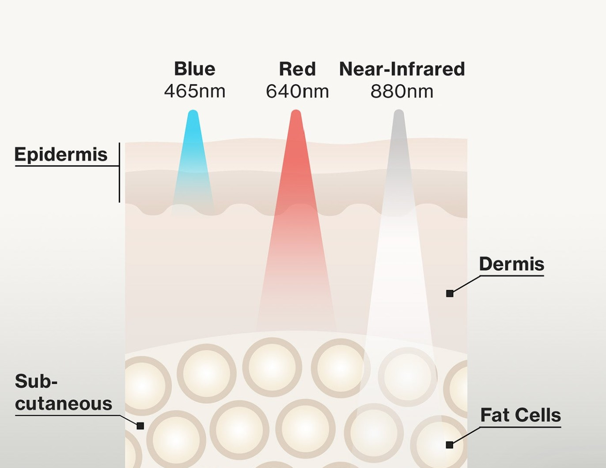
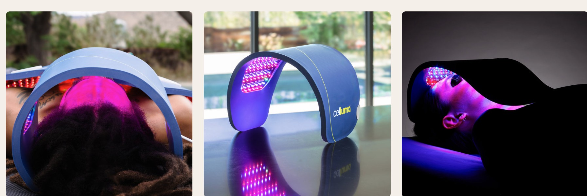

.. modified_time: 2025-05-27T01:32:47.403Z

.. _h.t9qk5ht96xqv:

LED Light Therapy Facial (Add-on only)
======================================

|image1|

Duration: 20 min

Price: $50

Experience the benefits of LED light therapy, which helps to improve
skin texture, reduce acne, and promote anti-aging effects for a
rejuvenated complexion. add-ons to any facial treatment.  Clinically
proven, FDA-cleared treatment of acne, aging skin, aches, and pain.

--------------

The wrinkles, acne, aches, and pains treatment modes contain a
combination of blue (465nm), red (640nm), and near-infrared (880nm)
wavelengths.

|image2|

Each treatment mode is a proprietary algorithm that produces the correct
combinations of wavelengths and fluence that deliver the results
supported by clinical. The wrinkles, acne, and aches and pains treatment
modes utilize a proprietary algorithm combining blue (465nm), red
(640nm), and near-infrared (880nm) wavelengths. This algorithm delivers
specific wavelength and fluence combinations supported by clinical
studies to achieve desired results.

**Red Light Therapy: Key Benefits**

-  **Healing & Repair:** Accelerates wound healing and tissue
   regeneration.
-  **Anti-Aging & Collagen:** Boosts collagen production for anti-aging
   effects.
-  **Pain & Inflammation:** Reduces swelling and inflammation,
   alleviating pain.
-  **Joint Health:** Improves the health and function of joints.
-  **Physical Performance:** Enhances physical performance, muscle
   recovery, and energy levels.
-  **Sleep Improvement:** Increases melatonin production for better
   sleep.

|image3|

**LED Light Therapy: A Dual Approach to Fighting Acne**

LED light therapy offers a non-invasive and effective solution for mild
to moderate acne by targeting the root causes and visible symptoms. This
FDA-cleared device utilizes blue and red light wavelengths to improve
skin clarity.

**Blue Light Therapy:** This component specifically targets and
eliminates acne-causing bacteria located beneath the skin's surface. By
destroying these bacteria at the source, blue light therapy helps to
reduce breakouts.

**Red Light Therapy:** Complementing the blue light, red light therapy
works to decrease inflammation associated with acne. Additionally, it
enhances overall skin tone and texture.

This dual-action treatment provides a natural approach to combating acne
by addressing both the bacterial infection and the resulting
inflammation, leading to clearer and healthier-looking skin.

**Revitalize with LED Light Therapy**

Aging leads to a slower metabolism, manifesting as wrinkles and joint
pain. LED light therapy addresses these signs by using red and
near-infrared light to stimulate fibroblast cells. This stimulation
boosts the creation of collagen and elastin, vital proteins for healthy
skin, joints, ligaments, and connective tissue. Consequently, increased
collagen and elastin production through LED light therapy helps to
maintain skin firmness and reduce age-related joint discomfort.

.. |image1| image:: images/1.02-1.jpg

