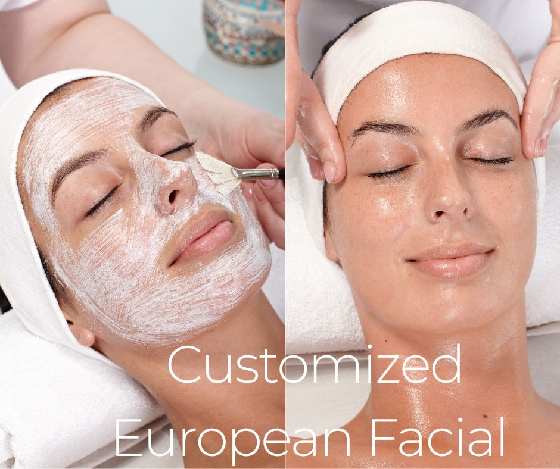

.. modified_time: 2025-06-07T03:24:26.661Z

.. _h.kujdv9tk3qh8:

Customized European Facial
==========================

|image1|

Time: 70 min

Price: $200

**If it is your first facial with us, please choose this option.**

The European Facial, a beloved treatment for generations, blends
traditional European techniques with modern skincare to rejuvenate and
brighten the complexion for both women and men.

--------------

.. _h.rxygj2d5g17d:

Custom European Facial Experience
---------------------------------

Discover how a European Facial  unveils your natural glow through a
meticulous process:

#. **Deep Cleansing and Exfoliation:** The facial begins with a thorough
   cleanse to eliminate surface impurities, unclogging pores, and
   preparing the skin for further treatment. Gentle exfoliation follows,
   removing dead skin cells to reveal a fresh, smooth surface and
   promote healthy cell renewal, enhancing the facial's overall
   effectiveness.
#. **Hot Towels and Extractions:** Steam and pre-extraction gel soften
   the skin and open pores, facilitating the gentle removal of
   blackheads and other impurities. This crucial step purifies the skin
   and helps prevent future breakouts.
#. **Soothing Massage:** Enjoy the relaxing facial massage, which
   stimulates blood circulation and relaxes facial muscles, contributing
   to a healthy and radiant complexion.
#. **Customized Mask:** Based on your specific skin concerns, we will
   select a tailored mask. Whether hydrating, clarifying, or anti-aging,
   this step replenishes the skin with essential nutrients and active
   ingredients.
#. **Moisturizing and SPF Application:** Following the mask, a
   moisturizer suitable for your skin type is applied to lock in the
   facial's benefits, leaving your skin soft and supple. Finally, SPF is
   applied to protect your skin from damaging UV rays, prolonging the
   results of your facial.

