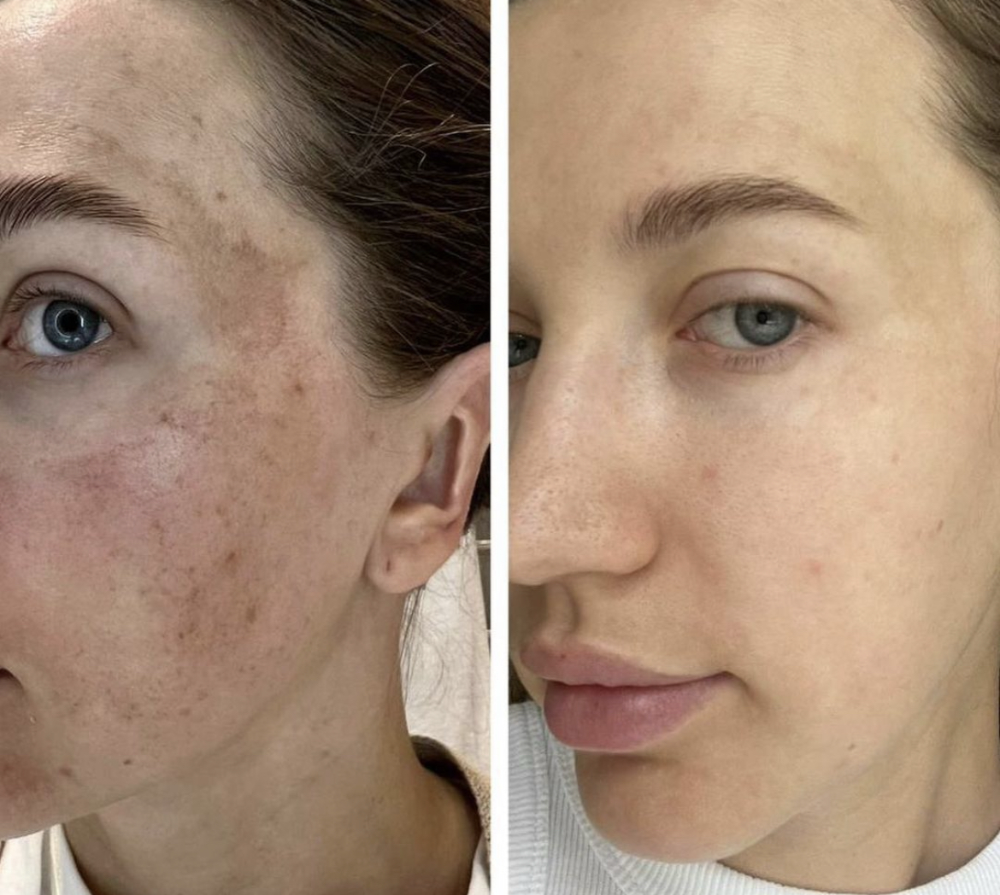

.. modified_time: 2025-05-27T01:34:28.241Z

.. _h.x1y4712jyzhk:

Diamond Microdermabrasion/Hydroderm
===================================

|image1|

Duration: 50 min

Price: $150

Experience the benefits of diamond microdermabrasion, a noninvasive
exfoliation treatment that improves skin texture, tone, and overall
radiance for a smoother complexion.

--------------

**Benefits of Hydrodermabrasion:**

Hydrodermabrasion exfoliates the outer skin layer to reveal a smoother
and more even texture. It effectively removes dead skin cells and
diminishes dark spots and hyperpigmentation with less discomfort and
irritation than microdermabrasion by using water and oxygen. Further
benefits include:

-  Freshens skin appearance and texture.
-  Plumps the complexion, reducing the appearance of fine lines and
   wrinkles.
-  Treats and reduces acne, while improving acne scarring.
-  Deeply cleanses to unclog and minimize the appearance of large pores.
-  Refines thickened skin.
-  Improves the appearance of pigmentation and sun-damaged skin.
-  Encourages the production of new collagen and elastin.

