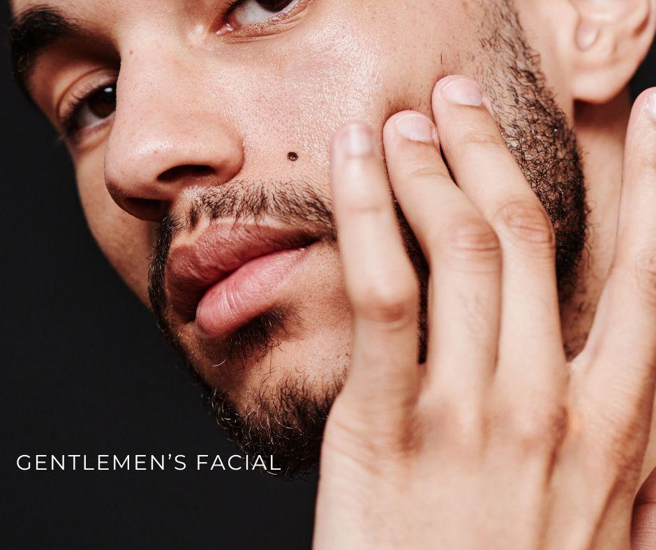

.. modified_time: 2025-02-13T04:58:48.772Z

.. _h.wxtepxecxkh7:

Gentlemen’s Facial
==================

|image1|

Price: $135

Time: 55 min

Designed for the modern man, this facial deep cleanses, hydrates, and
revitalizes the skin while addressing concerns such as razor irritation,
clogged pores, and dryness. Expect a smoother, healthier, and refreshed
complexion.

--------------

**Suitable for all skin types, including sensitive, aging, and
acne-prone skin.**

Designed specifically for men, The Gentleman’s Facial is a
results-driven treatment that targets the unique concerns of male skin.
Frequent shaving, environmental stressors, and increased oil production
can lead to irritation, clogged pores, and premature aging. This facial
is formulated to deeply cleanse, restore balance, and revitalize the
skin, leaving it refreshed, hydrated, and healthy-looking.

.. _h.u5fnho5hv6gf:

Key Benefits
------------

✔ **Deep pore cleansing** – Removes excess oil, dirt, and debris to
prevent breakouts and congestion

✔ **Exfoliation & cell renewal** – Smooths rough texture and minimizes
ingrown hairs caused by shaving

✔ **Hydration & moisture balance** – Replenishes lost moisture to combat
dryness and irritation

✔ **Anti-aging & skin repair** – Stimulates collagen production to
reduce fine lines and improve elasticity

✔ **Soothing & calming effect** – Reduces redness, sensitivity, and
inflammation for a comfortable post-shave feel

|image2|

.. _h.wj175ih5ao6r:

What to Expect – Step-by-Step Treatment
---------------------------------------

1️⃣ **Deep Cleansing** – A specialized cleanser removes excess oil and
impurities, prepping the skin for treatment

2️⃣ **Gentle Exfoliation** – A professional-grade exfoliant smooths rough
texture and clears pores

3️⃣ **Steam & Extractions** (if needed) – Opens pores and removes
blackheads and congestion

4️⃣ **Custom Masque & Hydration** – A nourishing masque tailored to your
skin type soothes, calms, and restores hydration

5️⃣ **Facial Massage & Finishing Touches** – A relaxing massage boosts
circulation, followed by application of serums, moisturizers, and SPF to
protect and maintain skin health

.. _h.w03gmybpg445:

Who Should Get This Facial?
---------------------------

The Gentleman’s Facial is perfect for men who experience:

✔ Skin irritation from shaving

✔ Clogged pores, blackheads, or excess oil

✔ Dull, rough, or tired-looking skin

✔ Signs of aging, including fine lines and loss of firmness

✔ Sensitive or reactive skin needing extra care

.. _h.j68h8deohgit:

Post-Treatment Care & Results
-----------------------------

After the treatment, the skin feels deeply cleansed, smooth, and
refreshed. There is no downtime, and results improve with regular
facials and a consistent home skincare routine. Daily SPF and hydration
are recommended to maintain and protect the skin’s health.

