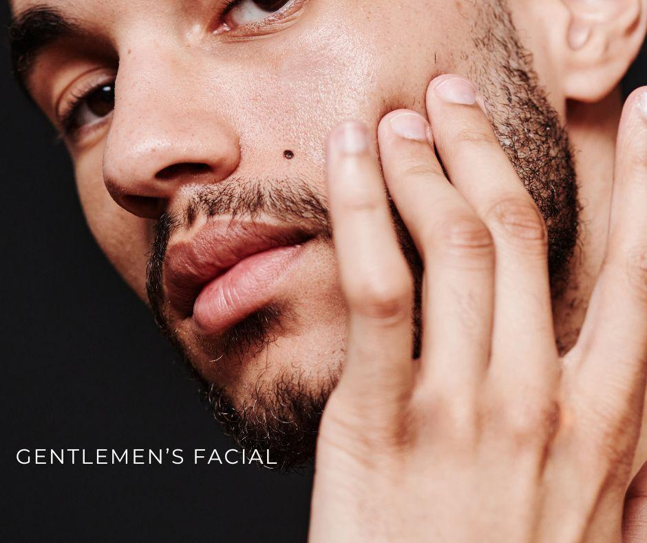

Gentlemen’s Facial
==================

.. modified_time: 2025-01-13T01:28:58.501Z

|image1|

Price: $200

Time: 60 min

This tailored facial uses the power of peptides, stem cells, and
exfoliators to effectively address the unique skincare concerns of men.
The treatment includes invigorating exfoliation, extractions, and
powerful anti-aging ingredients, followed by a hydrating mask. It
revitalizes, refreshes, and improves the health and appearance of men’s
skin, leaving it looking and feeling its best.

--------------

| This tailored facial uses the power of peptides, stem cells, and
  exfoliators to effectively address the unique skincare concerns of
  men. The treatment includes invigorating exfoliation, extractions, and
  powerful anti-aging ingredients, followed by a hydrating mask. It
  revitalizes, refreshes, and improves the health and appearance of
  men’s skin, leaving it looking and feeling its best.
| **Perfect For**: Men seeking a comprehensive skincare solution to
  improve skin health and appearance.
| **Benefits**: Hydrating, anti-aging, soothing, exfoliating,
  brightening
| **Indications**: Dry, dehydrated, oily, acne, fine lines and wrinkles,
  redness/inflammation
| **Contraindications/Considerations**: Allergies to citric acid, cocoa,
  papaya, or pineapple

