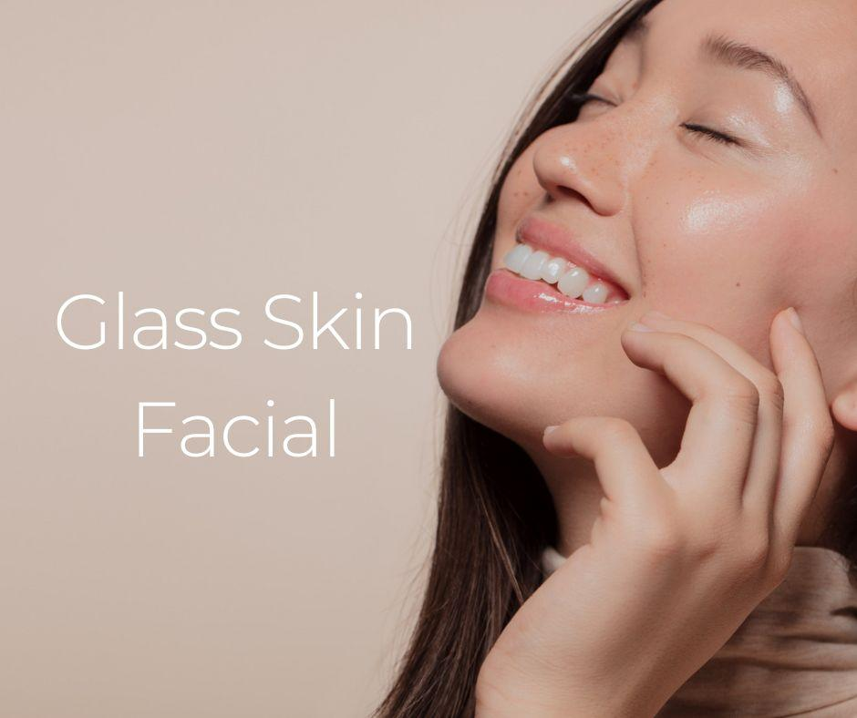

.. modified_time: 2025-04-20T02:08:45.733Z

.. _h.v8hkwk2qwfr8:

Glass Skin Facial
=================

|image1|

Time: 90 min

Price: $275

A luminous, dewy complexion with a smooth, glass-like finish. This
treatment focuses on deep hydration, exfoliation, and brightening to
achieve a radiant glow.

--------------

The Glass Skin Facial is designed to give you a luminous, dewy
complexion with a smooth, glass-like finish. This treatment focuses on
deep hydration, exfoliation, and brightening to achieve a flawless,
radiant glow. Using advanced techniques and high-quality products, it
targets uneven skin tone, texture, and dullness, leaving your skin
refreshed, youthful, and ultra-hydrated.

A highlight of this facial is the Australian Super Berry Mask, which
provides intense hydration while utilizing three powerful berries rich
in antioxidants. This mask nourishes the skin and offers gentle
exfoliation, promoting a smoother, brighter, and more even complexion.

| **Perfect For:** dry, dull, lackluster skin.
| **Benefits:** hydrating, rebalancing, detoxifying, lifting, and
  exfoliating.
| **Contraindications/Considerations:** recent use of retinol, active
  acne lesions, or skin sensitivities.

Achieve a radiant, glowing complexion with this transformative
treatment!

