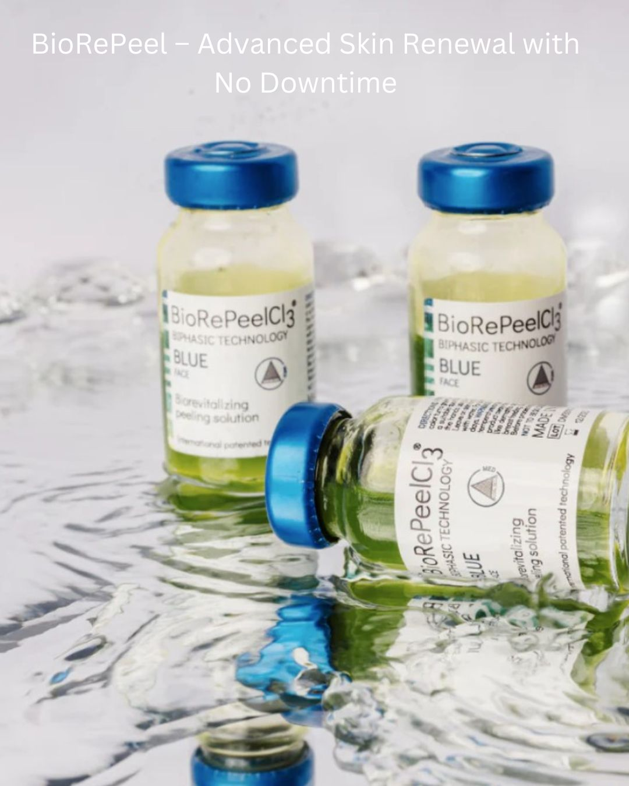

.. modified_time: 2025-02-16T05:13:23.390Z

.. _h.cnjgtugmdz03:

BioRePeel
=========

|image1|

Price: $220

Time: 30 min

This next-generation medical-grade chemical peel is designed to deliver
comprehensive skin rejuvenation with minimal downtime. Utilizing
biphasic technology, this innovative treatment effectively exfoliates,
hydrates, and stimulates collagen production, improving overall skin
health while targeting specific concerns such as acne, fine lines,
hyperpigmentation, and loss of elasticity.

--------------

**Best for:** All skin types, including sensitive, acne-prone, aging,
and hyperpigmented skin.

.. _h.was3oi87jaep:

Key Benefits of BioRePeel
-------------------------

-  **Gentle yet effective exfoliation** – Removes dead skin cells,
   revealing a brighter, more refined complexion.
-  **Anti-aging properties** – Stimulates collagen and elastin
   production to improve skin firmness and reduce the appearance of fine
   lines and wrinkles
-  **Acne management** – Unclogs pores, reduces inflammation, and helps
   prevent breakouts
-  **Skin texture improvement** – Minimizes pores, refines skin tone,
   and enhances cell turnover
-  **Deep hydration** – Infuses moisture into the skin, leaving it soft,
   supple, and refreshed
-  **Minimal to no downtime** – Unlike traditional chemical peels,
   BioRePeel allows patients to resume daily activities immediately.
-  **Safe for all skin types** – Formulated with gentle yet powerful
   ingredients, making it suitable for even the most sensitive skin

.. _h.7h2pwmr2f4ce:

How BioRePeel Works
-------------------

BioRePeel combines lipophilic and hydrophilic phases to penetrate deep
into the skin while preserving the epidermal barrier. This unique
approach enhances cellular regeneration without excessive peeling or
irritation, making it an ideal option for patients seeking visible
results with minimal disruption to their daily routine.

.. _h.jsmi9zuxsvot:

Treatment Process
-----------------

1️⃣ **Cleansing & Skin Preparation** – The skin is thoroughly cleansed to
remove any oil, makeup, and impurities.

2️⃣ **Application of BioRePeel Solution** – A specialized blend of acids
and active ingredients promotes deep exfoliation and skin renewal.

3️⃣ **Neutralization & Recovery Phase** – A soothing mask or serum is
applied to calm and restore the skin’s balance.

4️⃣ **Post-Treatment Hydration & Protection** – Hydrating serums and SPF
are applied to maintain skin health and enhance results.

.. _h.wo04pidnbm1d:

Who Is an Ideal Candidate?
--------------------------

BioRePeel is suitable for all skin types and tones, particularly those
experiencing:

✔ Acne or congested skin.

✔ Fine lines, wrinkles, and early signs of aging.

✔ Uneven skin tone, hyperpigmentation, or sun damage.

✔ Dull, dehydrated, or rough-textured skin.

✔ Enlarged pores and excess oil production.

.. _h.ar6r9icdn38o:

Results & Aftercare
-------------------

Patients can expect immediate radiance and smoother skin after just one
session. Based on individual skin concerns, a series of treatments is
recommended for optimal long-term results. There is no downtime, but
mild redness may occur, which typically subsides within a few hours.
Daily SPF use is essential post-treatment to protect the skin and
maintain results.

Schedule a consultation today to see if BioRePeel is the proper
treatment for your skin rejuvenation needs.

