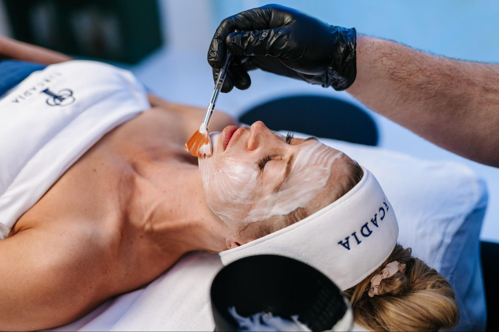

.. modified_time: 2025-02-16T05:00:52.887Z

.. _h.fl6j3b8b4q8g:

Firming Anti-Aging Peptide Facial
=================================

|image1|

Time: 90 min

Price: $200

A luxurious peptide facial that firms, lifts, and reduces wrinkles for
youthful skin.

--------------

Aging begins as early as 25, when collagen production slows, leading to
thinner, more fragile skin. Environmental factors like sun exposure and
dehydration further accelerate this process. While daily SPF and
hydration are essential, advanced treatments can stimulate collagen and
elastin production, helping to slow and even reverse signs of aging.

.. _h.fkeu3ekwjp8n:

What Makes This Facial Special?
-------------------------------

Our Firming Peptide Facial is a cutting-edge anti-aging treatment
designed to lift, firm, and rejuvenate your skin. This treatment uses
the latest peptide technology and powerful antioxidants to enhance
microcirculation, detoxification, and cellular renewal for visibly
younger, tighter skin.

.. _h.xdprr284cggo:

Key Benefits
------------

| ✔ Instantly firms and lifts the skin
| ✔ Reduces the appearance of fine lines and wrinkles
| ✔ Boosts collagen and elastin production
| ✔ Improves skin texture, hydration, and radiance
| ✔ Stimulates new cell growth for long-term results

.. _h.fa0nuex9t0jg:

What’s Inside?
--------------

This treatment features a potent blend of peptides and antioxidants,
including:

-  L-Carnosine & L-Carnitine – Boosts skin regeneration & elasticity.
-  Aspartic Acid & Glutamic Acid – Strengthens and repairs skin.
-  Beta Glucan – Deeply hydrates & soothes inflammation.
-  Green Tea & White Tea – Powerful antioxidants that fight free
   radicals.

.. _h.44gksfw7p4cs:

What to Expect
--------------

-  Gentle cleanse & exfoliation to remove dead skin cells.
-  Enzyme mask & activator for profound renewal.
-  Peptide-infused firming mask to tighten and lift.
-  Customized finishing serums & moisturizers.

.. _h.5jln4d9j9zxy:

Enhance Your Results
--------------------

For those with deeper lines or more advanced aging, consider adding an
Intense Vitamin A Retinol Peel for deeper exfoliation and enhanced cell
turnover.

