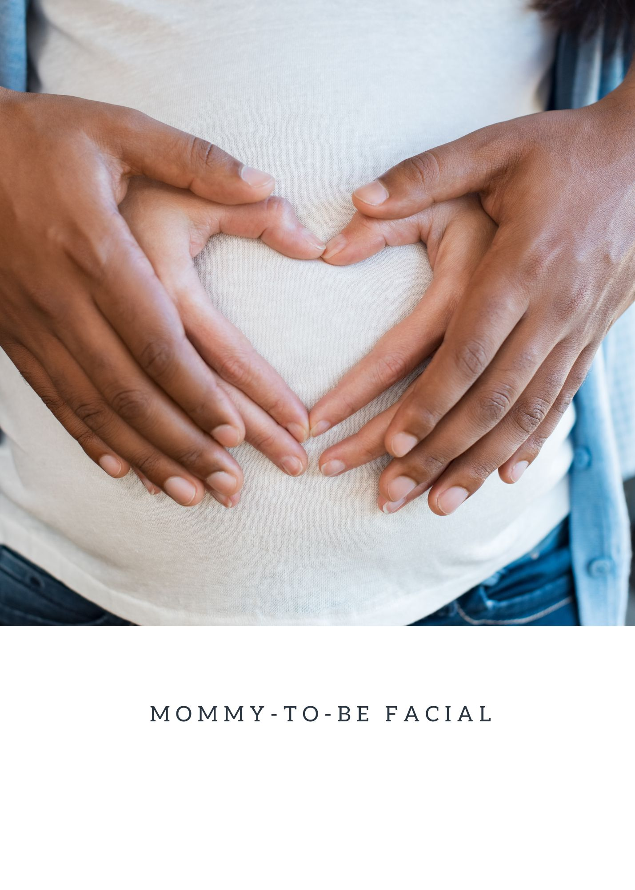

.. modified_time: 2025-03-30T16:12:16.695Z

.. _h.fhgtqdfp0j4c:

Mommy-to-Be Facial
==================

|image1|

Price: $150

Time: 60 min

Your skin will feel hydrated, refreshed, and glowing after the first
treatment. This facial is gentle enough for regular treatments
throughout pregnancy and postpartum, ensuring long-term skin balance and
hydration. Daily SPF and hydration are recommended to maintain results.

--------------

**Best for:** Pregnant & breastfeeding women with sensitive skin.

Do you think your pregnancy has you glowing now? Just wait until you
finish this facial! Designed with expecting and new mothers in mind, the
Mommy-to-Be Facial is a luxurious, pampering experience that hydrates,
soothes, and revitalizes your skin while ensuring safety for you and
your baby. Using only organic, pregnancy-safe ingredients, this
treatment addresses common pregnancy skin concerns such as melasma,
hormonal breakouts, dryness, and sensitivity while providing deep
relaxation.

.. _h.9b899ppjnmq5:

Key Benefits
------------

✔ **Safe for pregnancy & breastfeeding** – Free from harsh chemicals,
synthetic fragrances, and retinoids.

✔ **Gentle exfoliation** – Removes dull, dead skin cells without
irritation.

✔ **Deep hydration** – Restores moisture and calms sensitivity.

✔ **Brightening & balancing** – Helps reduce pregnancy-induced
pigmentation (melasma).

✔ **Relaxing & stress-relieving** – Includes a soothing jade roller
massage and paraffin hand treatment for ultimate comfort.

.. _h.sgw4blyqrvzp:

What to Expect
--------------

All Mommy-to-Be Facials begin with an in-depth skin analysis to assess
your current skin needs. This is followed by a luxurious neck, face, and
décolleté treatment to ensure complete rejuvenation.

1️⃣ **Gentle Cleansing** – A calming, organic cleanser removes impurities
while maintaining the skin’s natural balance.

2️⃣ **Mild Exfoliation with Passion Fruit Enzyme Peel** – A
pregnancy-safe fruit enzyme peel brightens and smooths the skin without
irritation.

3️⃣ **Jade Roller Massage** – A cooling jade roller massage soothes
puffiness, boosts circulation, and promotes relaxation.

4️⃣ **Deep Hydration Masque** – A nourishing mask infuses the skin with
moisture and antioxidants.

5️⃣ **Finishing Touches** – A protective moisturizer and SPF are applied
to keep the skin hydrated and shielded from environmental stressors.

6️⃣ **Paraffin Hand Treatment** – A warm paraffin wax application softens
and hydrates dry hands, adding a touch of pampering.

.. _h.v1k73n9ch6w2:

Who Is This Facial For?
-----------------------

The Mommy-to-Be Facial is ideal for:

✔ Pregnant & breastfeeding women looking for safe, effective skincare.

✔ Sensitive & reactive skin that needs hydration and calming.

✔ Hormonal breakouts or melasma caused by pregnancy-related changes.

✔ Expecting mothers needing relaxation and self-care.

.. _h.un34h22yxi53:

Results & Aftercare
-------------------

After the first treatment, your skin will feel hydrated, refreshed, and
glowing. This facial is gentle enough for regular treatments throughout
pregnancy and postpartum, ensuring long-term skin balance and hydration.
Daily SPF and hydration are recommended to maintain results.

✔ Gentle cleansing & exfoliation with a passion fruit enzyme peel.

✔ Jade roller massage to reduce puffiness & promote relaxation.

✔ Hydrating mask to restore moisture & calm sensitivity.

✔ Finishing moisturizer & SPF for protection & glow.

✔ Soothing paraffin hand treatment for added pampering.

Perfect for melasma, hormonal breakouts, dryness, and sensitive skin,
this facial ensures a radiant, refreshed complexion—with zero harsh
chemicals.

