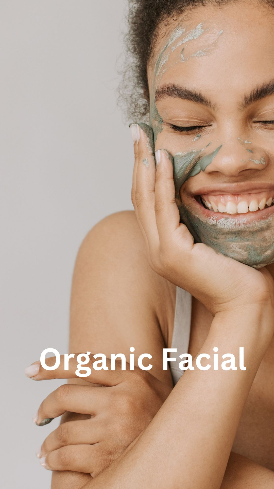

.. modified_time: 2025-02-16T06:48:14.307Z

.. _h.vk1ynm8vt9bb:

Organic Facial
==============

|image1|

Duration: 50 min

Price: $155

Revitalize your skin with our Organic Facial, using pure, organic
ingredients for cleansing, exfoliation, and hydration.

--------------

Treat yourself to the ultimate natural skincare experience with our
Organic Facial. This 50-minute treatment features pure, organic
ingredients to cleanse, exfoliate, and revitalize your skin. Enjoy
gentle exfoliation, targeted extractions, and a hydrating organic
alginate mask that firms and nourishes. To complete the experience,
indulge in a calming hand treatment that leaves your hands feeling soft
and rejuvenated. Suitable for all skin types, this facial will leave
your complexion glowing and refreshed.

Skin Types:

-  Normal Skin: Balances hydration for a glowing, refreshed complexion.
-  Dry Skin: Deeply hydrates and nourishes, leaving skin soft and
   smooth.
-  Oily Skin: Regulates oil production and promotes a clearer, more even
   complexion.
-  Sensitive Skin: Soothes irritation and redness with gentle, calming
   ingredients.
-  Combination Skin: Targets multiple concerns, balancing oily and dry
   areas for an even skin tone.

| **Great Add-On:** LED Mask for only $50
| Enhance your facial with an LED mask treatment to boost collagen
  production, reduce inflammation, and promote a healthy, radiant
  complexion.

