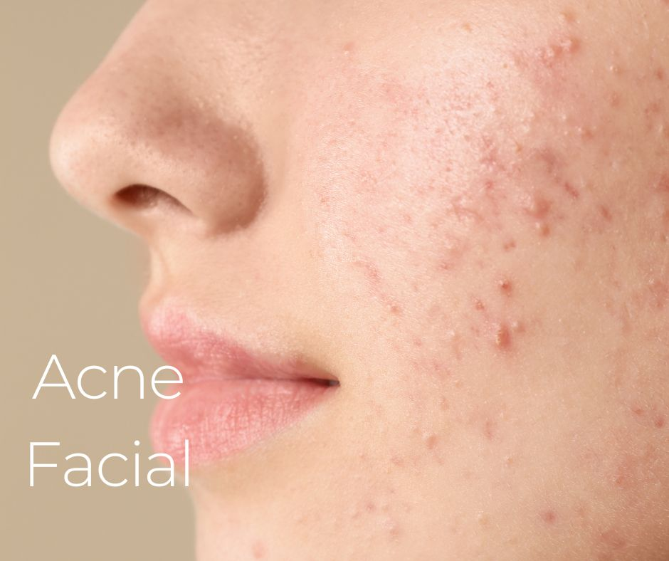

.. modified_time: 2025-06-07T07:00:29.508Z

.. _h.rdgu5kr95js6:

Acne Facial
===========

|image1|

Time: 70 min

Price: $199

The Purifying Facial for Congested, Dull Skin is a specialized skincare
treatment tailored to reduce and prevent acne breakouts. Unlike a basic
facial, this treatment focuses on purifying congested pores, reducing
inflammation, and minimizing future breakouts with active ingredients
and professional techniques. Each facial is customized based on your
current skin condition, whether you’re experiencing blackheads,
whiteheads, cystic acne, or post-acne marks.

--------------

.. _h.oc7kxdbek5mp:

What’s Included in the Acne Facial?
-----------------------------------

| **✔ Deep Pore Cleansing** – Removes buildup of oil, dirt, and debris
| **✔ Steam & Extractions** – Opens pores and gently removes blackheads
  and comedones
| **✔ Enzyme or Chemical Exfoliation** – Dissolves dead skin cells and
  reduces clogged pores
| **✔ High-Frequency Therapy (if needed)** – Kills acne-causing bacteria
  and speeds healing
| **✔ Calming Mask** – Reduces redness and soothes inflamed skin
| **✔ Oil-Free Hydration** – Restores moisture without clogging pores
| **✔ Product Recommendations** – Professional guidance to help maintain
  results at home

.. _h.xh65anf47lyk:

Benefits of an Acne Facial
--------------------------

-  Unclogs pores and removes excess oil
-  Reduces breakouts and calms inflammation
-  Improves skin texture and tone
-  Speeds up the healing of active blemishes
-  Prevents future acne formation with expert care

.. _h.dnlihu1f4xvt:

Why Professional Acne Care Matters
----------------------------------

Unlike over-the-counter treatments that often dry out or irritate the
skin, a professional Acne Facial uses high-quality, targeted products
and techniques to treat acne without causing additional damage. Our goal
is to restore balance, support your skin barrier, and give you the
confidence of clearer, healthier skin.

For best results, acne facials may be recommended in a series,
especially if you are actively breaking out. We also combine our
treatments with education on skincare habits, home care products, and
lifestyle tips to support long-term skin health.

.. _h.gacvy55c9l04:

Who Is This Facial For?
-----------------------

| ✔ Teens and adults experiencing acne breakouts
| ✔ Clients with congested skin, blackheads, or oily texture
| ✔ Sensitive, inflamed, or acne-prone skin types
| ✔ Those who have tried multiple products with little success

