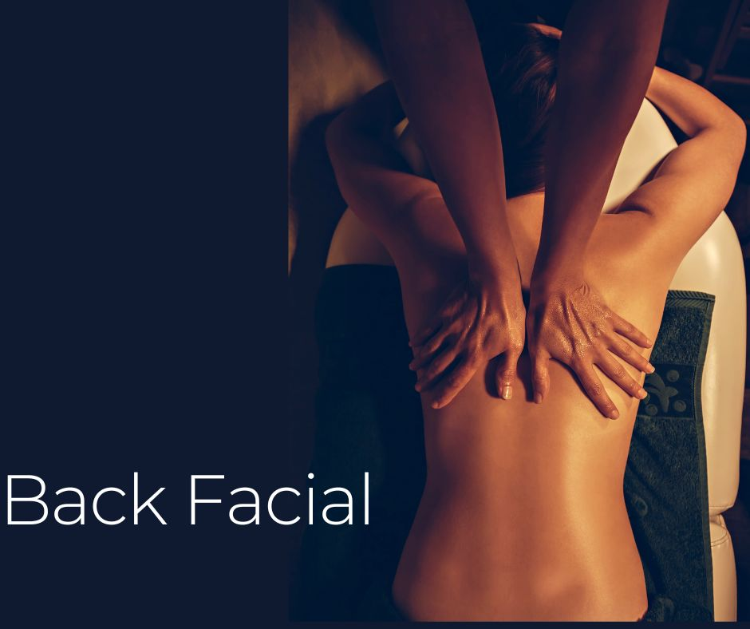

.. modified_time: 2025-06-07T03:58:34.075Z

.. _h.u3umhyz4wqc9:

Back Facial
===========

|image1|

Time: 60 min

Price: $139

This professional treatment is designed to cleanse, exfoliate, and treat
the skin on your back, leaving it smooth, clear, and refreshed. Whether
you’re struggling with "bacne," dry patches, or just want your back to
feel and look better, this targeted service is a game-changer.

--------------

.. _h.tka5bz3h6adj:

What Is a Back Facial?
----------------------

A **Back Facial** is a therapeutic skincare treatment that applies the
same principles as a regular facial — cleansing, exfoliation,
extraction, hydration, and treatment—only it’s designed for the unique
needs of the back. Because this area tends to be thicker and oilier, it
requires a deeper level of care to effectively target congestion and
irritation.

Our Back Facial begins with **gentle steaming,** which opens the pores
and softens impurities for easier cleansing and extraction. A **deep
cleansing** follows to remove sweat, oil, and dirt buildup. Then, an
**exfoliation process** sloughs off dead skin cells to encourage renewal
and smoothness. For those dealing with back acne or blemishes, a
**targeted acne treatment** is applied to calm inflammation and purify
the skin.

To complete the treatment, a **soothing mask** is used to hydrate and
calm the skin, followed by a **moisturizing finish** that locks in
hydration and nourishment.

.. _h.e6wbk9qdveco:

Who Is It For?
--------------

You don’t have to have acne to benefit from a Back Facial. This
treatment is perfect for:

-  Those experiencing breakouts, blackheads, or clogged pores on their
   back
-  Active individuals who sweat often or wear tight-fitting clothing
-  Anyone with dry, flaky, or rough skin texture
-  People preparing for a vacation, an event, or an open-back outfit
-  Anyone who simply wants to feel cleaner and more confident

.. _h.dxbzygzsp50:

The Benefits of a Back Facial
-----------------------------

| **1. Deep Cleansing**
|  By removing oil, dirt, and sweat buildup, this treatment helps
  prevent breakouts and reduces the risk of long-term congestion.

| **2. Exfoliation and Smoothing**
|  Professional-grade exfoliation removes dead skin cells, improving
  texture and encouraging skin renewal.

| **3. Acne and Blemish Reduction**
|  With targeted treatments, inflammation is soothed, and breakouts
  become less frequent and less severe.

| **4. Hydration Boost**
|  Dryness and tightness are relieved with deeply nourishing products,
  making your skin feel soft and comfortable.

| **5. Relaxation and Confidence**
|  Let’s not forget the calming and rejuvenating benefits of any good
  skincare treatment—it’s self-care for your body and your mind.

