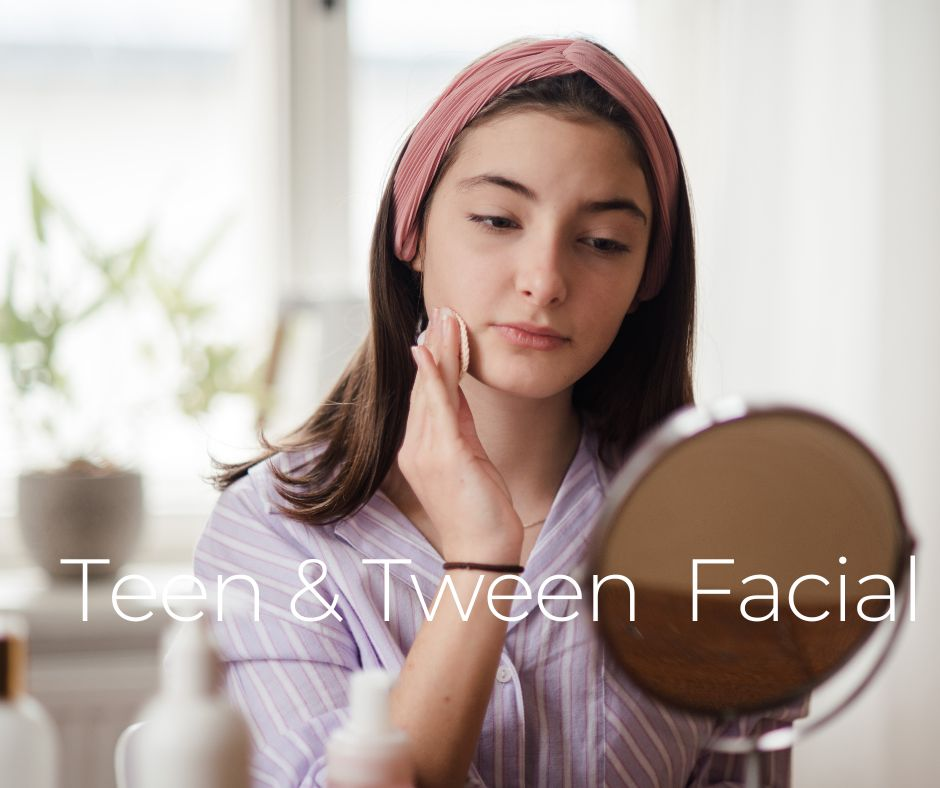

.. modified_time: 2025-06-07T03:48:24.788Z

.. _h.832ut6b5ivdy:

Teen & Tween Acne Facial
========================

|image1|

Price: $145

Duration: 45 min

Navigating skin changes during the tween and teen years can be confusing
and frustrating. Hormonal shifts, increased oil production, and
inconsistent routines often lead to breakouts, clogged pores, and
irritation. Add in a constant stream of TikTok skincare trends, and
suddenly your teen is experimenting with harsh actives, using five
different products at once, or copying routines that aren’t meant for
their skin type. That’s why our **Teen & Tween Acne Facial** is more
than just a treatment — it’s an educational and confidence-building
experience.

--------------

.. _h.q9r8xjybypwp:

What Makes This Facial Unique?
------------------------------

This 45-minute session is customized specifically for young, developing
skin. It includes a professional deep cleanse, gentle exfoliation, and
extractions if needed—all designed to calm breakouts, reduce redness,
and restore skin balance without overwhelming sensitive, youthful
complexions.

.. _h.71yn82srbc8g:

What's included:
----------------

✔ **Gentle Cleansing & Enzyme Exfoliation**

✔ **Steam & Extractions (if appropriate)**

✔ **Soothing Mask to Calm Inflammation**

✔ **Oil-Free Hydration**

✔ **Professional Skincare Starter Kit**

✔ **Step-by-Step Skin Care Instruction from a Licensed Esthetician**

|image2|

.. _h.2uoxhakzja2p:

Why Professional Skincare for Teens Matters
-------------------------------------------

Starting early with proper skincare education can prevent long-term skin
damage and reduce the likelihood of acne scars, bad habits, and
emotional stress tied to self-image. While online videos may seem
helpful, they often promote one-size-fits-all solutions—or worse,
harmful fads. Misinformation can lead to irritation, allergic reactions,
and more breakouts.

As a licensed esthetician with years of experience, I teach your teen or
tween exactly how to care for their skin, not someone else's. They’ll
leave knowing how to:

-  Properly cleanse and moisturize
-  Choose the right ingredients (and avoid the wrong ones!)
-  Establish a routine that’s realistic, safe, and effective
-  Feel confident in their skin

And yes — we know teens will listen to almost anyone but their parents.
That’s where I come in. I'll guide them with patience, kindness, and
facts, not fads.

.. _h.4nv4u09ljuwe:

Who Is This Facial For?
-----------------------

✔ Pre-teens and teenagers ages 10–18

✔ Tweens just starting to notice oiliness or breakouts

✔ Teens struggling with blackheads, whiteheads, or inflamed acne

✔ Young clients who need simple, trustworthy skincare guidance

