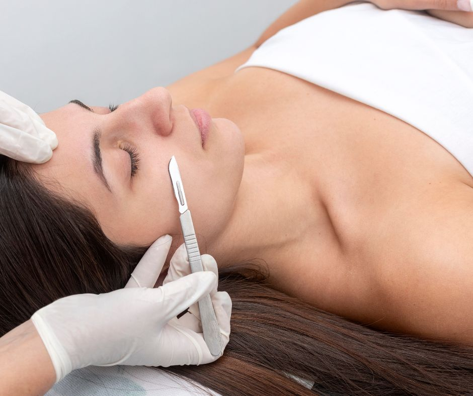
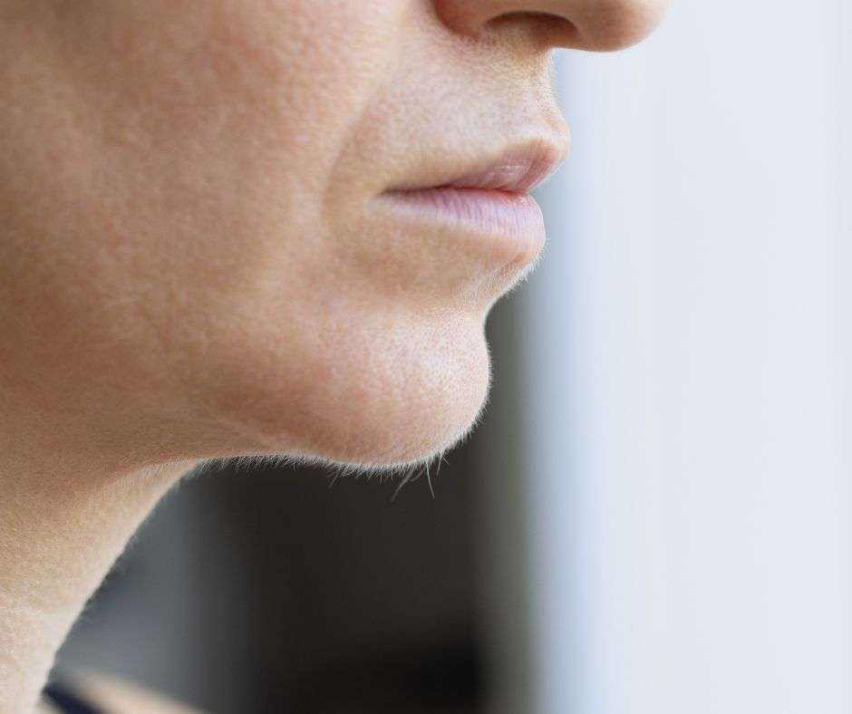
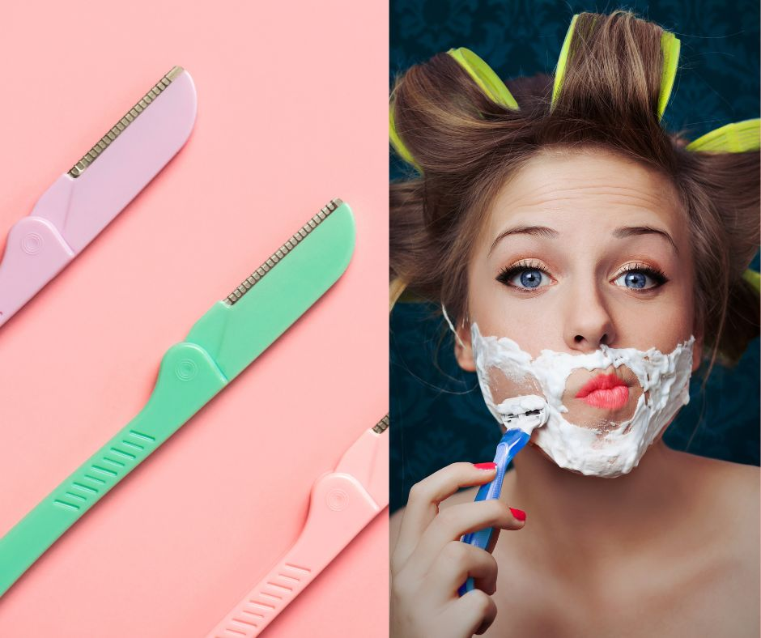

.. modified_time: 2025-06-07T06:57:49.960Z

.. _h.gvd2fx4oz16c:

Dermaplaning with Facial
========================

Time: 60 min

Price: $145

At Seattle Beauty Lounge, our skilled estheticians offer professional
dermaplaning treatments that gently exfoliate the top layer of dead skin
cells while removing fine vellus hair (peach fuzz). This safe,
chemical-free procedure helps your skin feel silky smooth, boosts
radiance, and enhances product absorption and makeup application.

|image1|

.. _h.p63n8cz4ugf8:

--------------

.. _h.3cm4njworuzx:

.. _h.yw2ls4wn84ih:

What Is Dermaplaning?
---------------------

Dermaplaning is a non-invasive exfoliating treatment that uses a
sterile, medical-grade scalpel to lightly scrape away dead skin and
facial fuzz. This process instantly refreshes the skin’s surface,
leaving it looking clean, bright, and smooth.

.. _h.h4s9xncpj47c:

What to Expect During Your Appointment
--------------------------------------

After a gentle cleanse, your esthetician will use precise strokes to
exfoliate the skin using a dermaplaning blade. The treatment is
completely painless—many describe it as a light brushing sensation.

The full session typically lasts 60 minutes and includes customized
post-treatment skincare to hydrate and soothe your skin.

.. _h.kc9rwy734oxq:

|image2|\ Benefits of Dermaplaning
----------------------------------

-  Smooths and softens skin instantly
-  Removes dead skin cells and fine hair
-  Brightens dull complexions
-  Enhances makeup application
-  Helps reduce the appearance of acne scars and sun damage
-  Promotes deeper absorption of skincare products
-  Safe for most skin types
-  No downtime, minimal irritation

.. _h.305xen8nb8ie:

Who Should Avoid Dermaplaning?
------------------------------

Although suitable for most people, we may advise caution if you have:

-  Active acne breakouts
-  Extremely sensitive skin
-  Rosacea or eczema
-  Keratosis pilaris on the face

Your esthetician will provide a personalized consultation to determine
if dermaplaning is right for you.

.. _h.7ufo9b1rswni:

What About DIY Dermaplaning?
----------------------------

|image3|

While drugstore tools might promise similar results, they can’t
replicate the safety or effectiveness of professional dermaplaning. At
Seattle Beauty Lounge, we use professional-grade tools in a sterile,
controlled setting to deliver flawless results without the risk of
injury or irritation.

.. _h.bwcnr5nokksb:

Will My Hair Grow Back Thicker?
-------------------------------

No, dermaplaning doesn’t alter hair texture. Your peach fuzz will grow
back exactly as it was before.

.. _h.ccdr47uh4btt:

Aftercare & How Often to Schedule
---------------------------------

Post-treatment, your skin may be more sensitive to the sun, so apply SPF
daily and avoid harsh skincare ingredients for 24–48 hours. Most clients
return every 4 to 6 weeks for optimal maintenance and glow.

