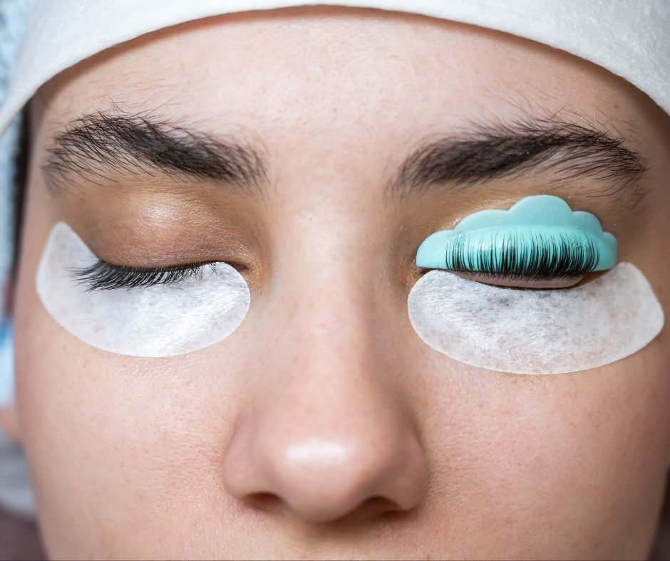
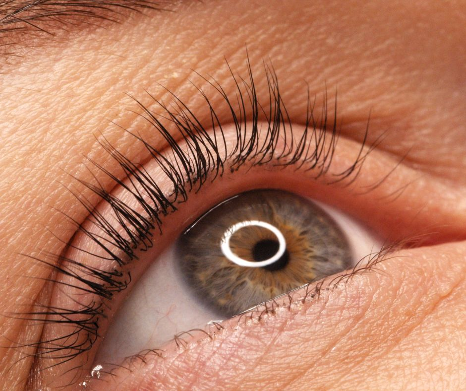

.. modified_time: 2025-06-07T03:06:32.092Z

.. _h.kujdv9tk3qh8:

Eyelash lift and tint
=====================

|image1|

Duration: 45 min

Price: $100

Enhance natural lashes with a lift and tint treatment for a long-lasting
curled effect and darker, more defined lashes.

--------------

.. _h.ro2d4y310xot:

What Is a Lash Lift & Tint?
---------------------------

An eyelash lift and tint is a beauty treatment that curls and darkens
natural eyelashes to enhance their appearance.

A **lash lift** works like a perm for your eyelashes, giving them a
gentle, lasting curl. Your master esthetician customizes the curl based
on your lash length and desired look, ranging from subtle and natural to
bold and dramatic.

A **lash tint** is a semi-permanent dye that darkens your lashes, making
them look fuller and more defined, perfect for anyone with blonde, red,
or light-colored lashes.

When combined, a lash lift and tint can make your eyes pop without any
makeup. Results typically last 6–8 weeks, depending on your natural lash
cycle and aftercare.

--------------

.. _h.aztkn1rpsejp:

Benefits of a Lash Lift & Tint
------------------------------

-  Effortless, defined lashes—no daily curling or mascara needed
-  Accentuates your natural beauty without the use of extensions
-  Works for all lash lengths and eye shapes
-  No downtime—just avoid water and products for the first 24 hours
-  Long-lasting results (6–8 weeks on average)
-  Low maintenance and gentle on natural lashes
-  Complements brow tinting for a complete eye-enhancing look
-  Safe, quick, and pain-free treatment

.. _h.liylxac08fgx:

Lash Lift vs. Lash Extensions
-----------------------------

+----------------------+----------------------+----------------------+
| **Feature**          | **Lash Lift & Tint** | **Lash Extensions**  |
+----------------------+----------------------+----------------------+
| Uses your natural    | ✅ Yes               | ❌ No (adds          |
| lashes               |                      | synthetic fibers)    |
+----------------------+----------------------+----------------------+
| Maintenance level    | ✅ Low (minimal      | ❌ High (requires    |
|                      | care)                | refills, extra care) |
+----------------------+----------------------+----------------------+
| Safe with makeup     | ✅ Yes (after 24     | ❌ Limited (some     |
|                      | hrs)                 | products not         |
|                      |                      | compatible)          |
+----------------------+----------------------+----------------------+
| Custom curl/look     | ✅ Yes               | ✅ Yes               |
+----------------------+----------------------+----------------------+
| Treatment time       | ✅ ~1 hour           | ❌ 1.5–2 hours       |
+----------------------+----------------------+----------------------+
| Chemical exposure    | ✅ Minimal           | ❌ Possible allergic |
|                      |                      | reactions to glue    |
+----------------------+----------------------+----------------------+
| Tinting              | ✅ Yes (often done   | ❌ Not recommended   |
| compatibility        | together)            |                      |
+----------------------+----------------------+----------------------+

.. _h.l1x3lmgdrzle:

What To Expect
--------------

.. _h.ae3ix7smbid3:

**Consultation**
^^^^^^^^^^^^^^^^

Before your first lash lift and tint, your master esthetician will meet
with you to discuss your goals, lifestyle, and any sensitivities. We'll
evaluate your lash length and condition to determine the best approach
and curl for your unique features.

.. _h.f4k3ih44upkr:

**Treatment Process**
^^^^^^^^^^^^^^^^^^^^^

Please arrive with clean, makeup-free lashes. The entire treatment takes
about an hour. Here's what happens:

#. We clean your lashes and eye area.
#. A silicone pad is placed on the upper lid.
#. Your lashes are gently curled over the pad and set with a lifting
   solution.
#. We apply a tint to darken and define.
#. After setting, we remove the solutions and pads to reveal lifted,
   tinted lashes.

Your eyes stay closed for most of the procedure, and you’ll feel nothing
more than light pressure or tugging.

|image2|

.. _h.6vpkmlwnnysq:

Aftercare & Longevity
---------------------

**For the first 24–48 hours, follow these aftercare tips:**

-  Avoid getting your lashes wet (no water, steam, or sweating)
-  Don’t apply mascara, makeup, or skincare around the eyes
-  Avoid rubbing or touching your lashes
-  Sleep on your back the first night
-  No facials, lash curlers, or additional eye treatments

After the initial window, you can return to your routine, including
makeup and skincare. Results last 6–8 weeks, depending on your lash
growth cycle.

.. _h.j9m7yo8yxrun:

Who’s a Good Candidate?
-----------------------

Lash lifts and tints work best for those with medium to long lashes. If
your lashes are very short, we may recommend an alternative or give
guidance on strengthening treatments first. It’s also ideal for anyone
looking for a low-maintenance beauty routine with lasting results.

.. _h.9rbq249h74ei:

Client Testimonials
-------------------

| **"This was my first time visiting a cosmetic provider, and they made
  me feel very comfortable. Staff was professional and kind. I'm in love
  with my lashes!"**
|  — Deidra

| **"Everyone was friendly and professional. Great experience from start
  to finish!"**
|  — Amelia

| **"My esthetician made me feel beautiful and confident. I left with
  lashes I didn't know I could have!"**
|  — Sara

