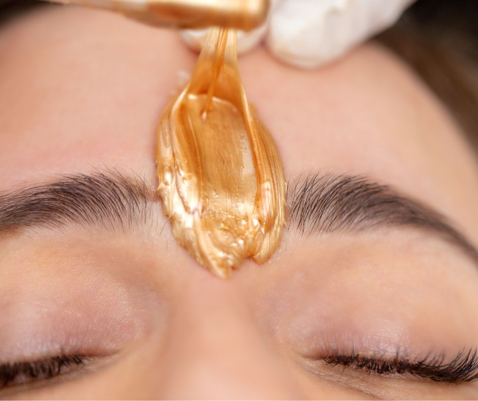
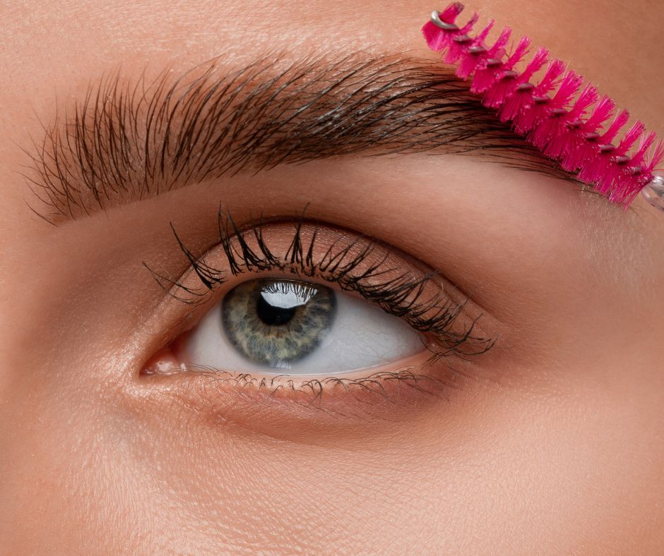

.. modified_time: 2025-06-07T03:34:22.449Z

.. _h.5aacqai9aw7w:

Eyebrow shaping and tinting
===========================

Achieve perfectly shaped and tinted brows that frame your face
beautifully with our expert brow shaping and tinting service.

Time: 30 min

Price: $65

|image1|

--------------

Every decade rewrites the rules of eyebrow beauty. The 90s loved
pencil-thin, overplucked arches. The early 2000s brought rounded,
minimal brows. And now? Thick, defined brows are the standard of modern
beauty. But what happens if your natural brows are light, sparse, or
just don't frame your face the way you'd like?

.. _h.rpaqw9txl6gx:

What Is Brow Tinting?
---------------------

Eyebrow tinting is a semi-permanent treatment that uses specially
formulated dye to enhance the color, shape, and fullness of your brows.
Whether you're looking to subtly deepen your natural color or go bolder
to match a new hair color, tinting can help create that well-defined,
polished look without makeup.

The tint typically lasts **4 to 6 weeks**, depending on your hair type
and aftercare. Perfect for busy professionals, active lifestyles, or
anyone wanting a low-maintenance beauty routine.

|image2|

.. _h.e1omhujkzuk6:

Our customized process includes:
--------------------------------

-  Personalized color selection
-  Precise shaping and clean-up
-  Optional brow waxing or lamination add-ons
-  Aftercare guidance for long-lasting results

.. _h.832oevqtyquu:

Benefits of Eyebrow Tinting
---------------------------

-  **Fuller, more defined brows** without the need for pencils or
   pomades
-  **Symmetry and shaping** for a lifted, youthful look
-  **Time-saving** in your daily routine
-  **Waterproof and sweat-proof**—perfect for summer, the gym, and
   travel
-  Great for clients with **blonde, gray, or thinning brows**
-  **Zero downtime**—results are instant, and the process is painless

.. _h.kv2hvtgo3jzv:

Aftercare Tips
--------------

To get the most out of your tint:

-  Avoid water, sweat, and steam for 24–48 hours
-  Don’t use oil-based skincare on the brows
-  Gently cleanse around the area
-  Book your refresh every 4–6 weeks

