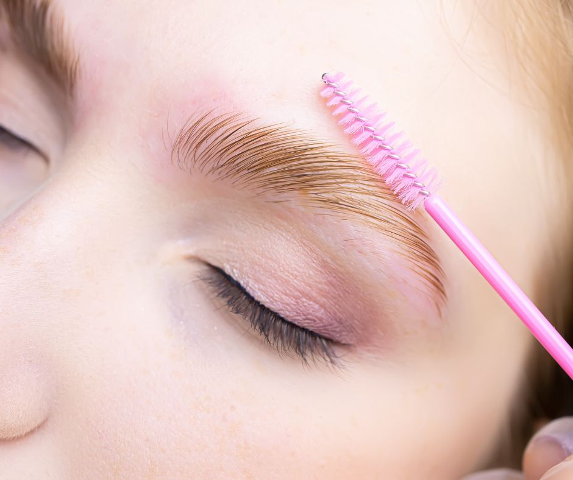

.. modified_time: 2025-06-07T03:11:00.427Z

.. _h.cztt5ztkqs1l:

Eyebrow Lamination
==================

Want fuller, lifted, and more refined eyebrows — without the hassle of
daily brow gel or pencil? Brow lamination is a non-invasive treatment
that straightens and sets your brow hairs into a sleek, uniform shape
that lasts for weeks. It’s one of the easiest ways to instantly
transform your brows for a polished, modern look.

Time: 45 min

Price: $100

|image1|

--------------

.. _h.r44nkia6vw24:

What is Brow Lamination?
------------------------

Think of it as a perm—but for your brows. Brow lamination restructures
the direction of your natural brow hairs using a gentle two-step
solution. The result? Lifted, fuller, and neatly aligned brows that stay
in place without the need for daily styling.

The term “lamination” refers to the use of plastic wrap during the
setting phase, which helps the product work more effectively and shapes
the brows in the desired direction.

.. _h.slz78kbj748l:

Ideal Candidates for Brow Lamination:
-------------------------------------

-  Brows that are curly, unruly, or uneven
-  Clients looking for a fluffier, fuller brow
-  Those growing out overplucked brows
-  People who want a lifted, more youthful brow shape
-  Anyone seeking a semi-permanent brow enhancement without microblading

.. _h.ld94i41cnoae:

|image2|
~~~~~~~~

.. _h.57vgtlsp0ra:

Benefits of Brow Lamination:
----------------------------

-  Fuller-looking, lifted brows
-  Smooths out gaps and patchiness
-  Creates symmetry and clean definition
-  Non-surgical and completely pain-free
-  Lasts 4 to 6 weeks on average
-  Safe for most skin types
-  Minimal to no downtime
-  Pairs beautifully with brow tinting or shaping

.. _h.9rbxhkrd7c36:

What to Expect During Your Appointment
--------------------------------------

#. **Consultation:** Your esthetician will assess your brows, hair
   texture, skin type, and brow goals.
#. **Prep & Cleanse:** We begin with a thorough cleansing of the brows.
#. **Lifting Phase:** A gentle solution is applied to relax the hairs.
#. **Shaping:** Brows are brushed into the ideal shape.
#. **Setting Phase:** A second solution locks the hairs into place.
#. **Finishing Touches:** Optional tinting, waxing, or tweezing may be
   added for a complete look.

The entire process takes about **30 to 45 minutes**, and results last
**4–6 weeks** with proper care.

.. _h.h11pcbgcln0h:

Aftercare Tips
--------------

For the first 24 hours after your brow lamination:

-  Avoid getting your brows wet
-  Skip makeup and heavy skincare on the area
-  Avoid steam, heat, or sun exposure
-  Do not apply oils or exfoliants

Keeping your brows hydrated with a nourishing brow serum after 24 hours
can help maintain softness and flexibility.

Many clients choose to combine **lamination and tint** for a truly
transformative result.

