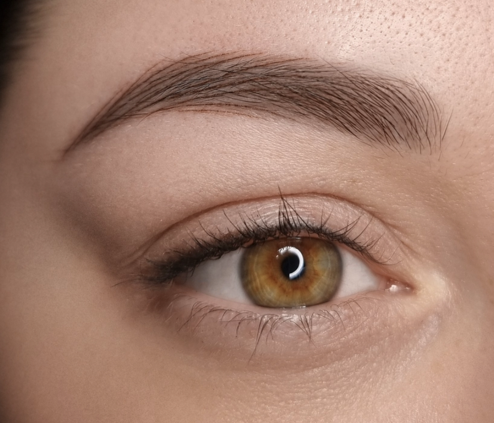

.. modified_time: 2025-01-17T20:15:28.347Z

.. _h.3wrgc991d1ks:

Eyebrow microblading
====================

This technique offers an alternative to traditional methods and produces
crisp, sharp, and ultra-thin hair strokes that look extremely lifelike.
Our expert technician uses advanced equipment to create this effect,
leaving you with perfectly shaped and defined brows. With nanomachine
strokes, you can enjoy a natural, low-maintenance solution to your
eyebrow needs, without the hassle of daily makeup application. Say
goodbye to mediocre brows and hello to the perfect, realistic brows
you've always wanted!

Duration: 180+ min

Price: $650+

|image1|

